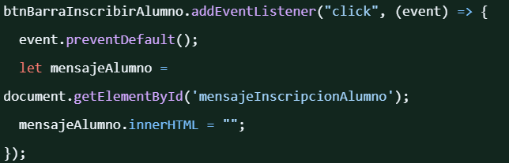

Issue 1: https://github.com/IngSoft-FIS-2024-2/proyecto-m3b-m4d-alonso-cabrera-carriquiry/issues/2

Para solucionarlo se modifica en los campos input en la pestaña correspondiente los .value por .placeholder

Issue 2: https://github.com/IngSoft-FIS-2024-2/proyecto-m3b-m4d-alonso-cabrera-carriquiry/issues/3

Para solucionarlo se agrega al inicio de la funcion llamada al hacer click que restablezca el texto, ademas se añade que al agregar un ususario se restablecen los campos de nombre y apellido

Tambien se incorpora que al hacer click en la barra para mostrar la pestaña se restablecen los textos

Issue 3: https://github.com/IngSoft-FIS-2024-2/proyecto-m3b-m4d-alonso-cabrera-carriquiry/issues/4

Este issue se ignora ya que escapa de el objetivo del proyecto determinado por el grupo en el primer issue( acordado con el docente).

Issue 4: https://github.com/IngSoft-FIS-2024-2/proyecto-m3b-m4d-alonso-cabrera-carriquiry/issues/5

Al igual que en issue 2 se añade que al seleccionar la pestaña se restablezcan los textos

Y para solucionar el error declarado en el issue se suma que al establecer el texto de error tambien se setea el texto de resultado como vacio

Issue 5:https://github.com/IngSoft-FIS-2024-2/proyecto-m3b-m4d-alonso-cabrera-carriquiry/issues/6

Este fue el issue más complejo de resolver ya que este error se basaba en que el .value de el dropdown se diferenciaba con el valor validado en la clase de dominio de prueba diagnostica, por lo cual se modifica este última.

Issue 6: https://github.com/IngSoft-FIS-2024-2/proyecto-m3b-m4d-alonso-cabrera-carriquiry/issues/7

Se modifica el valor del titulo en el HTML

