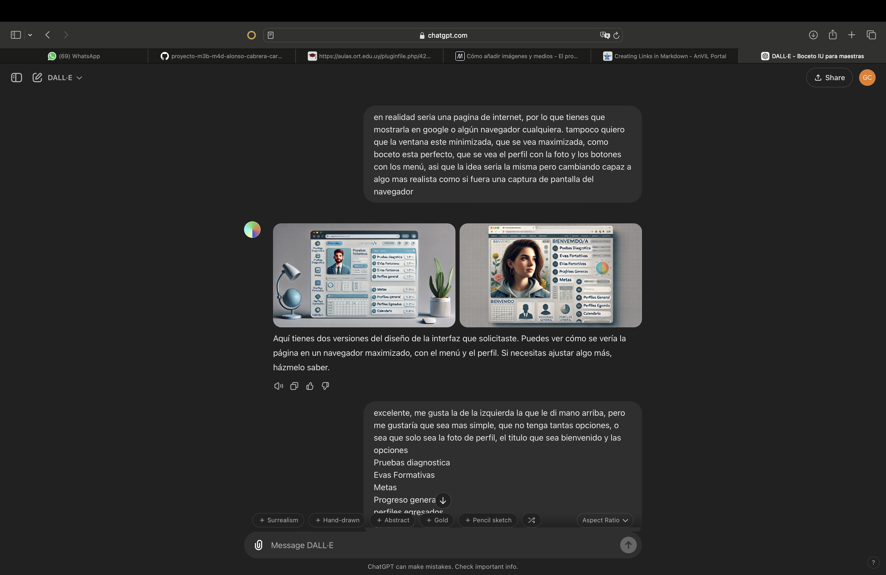
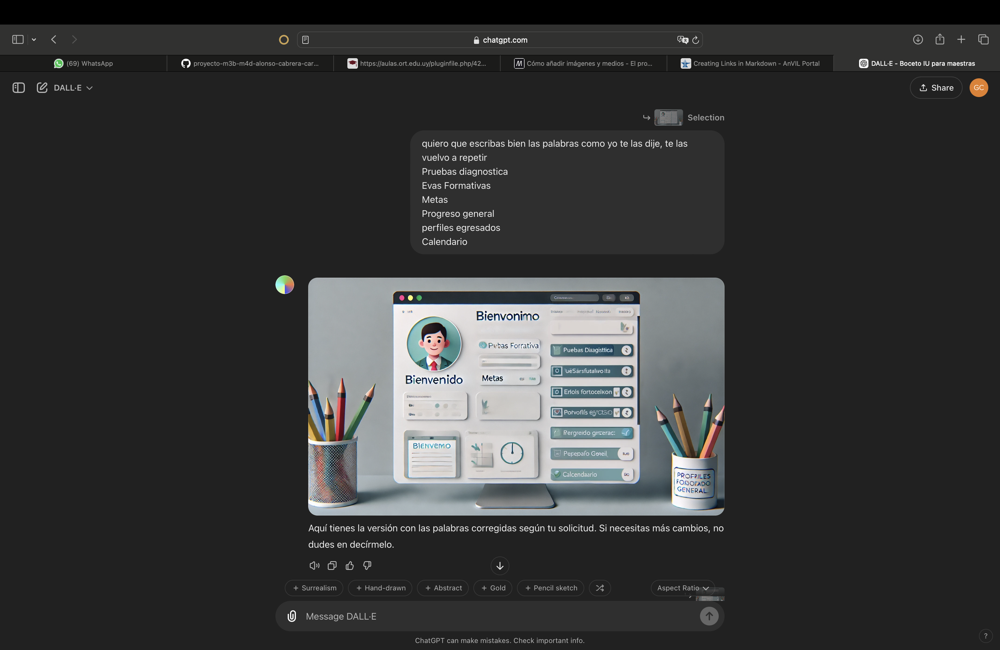
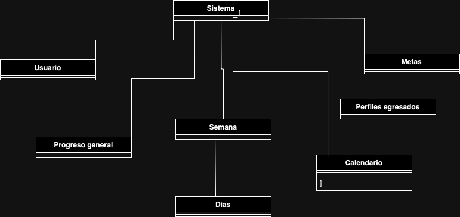
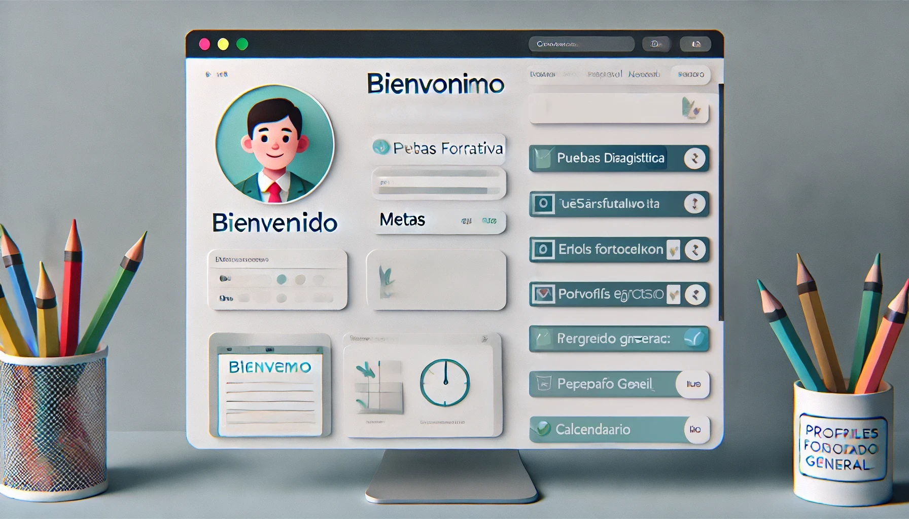
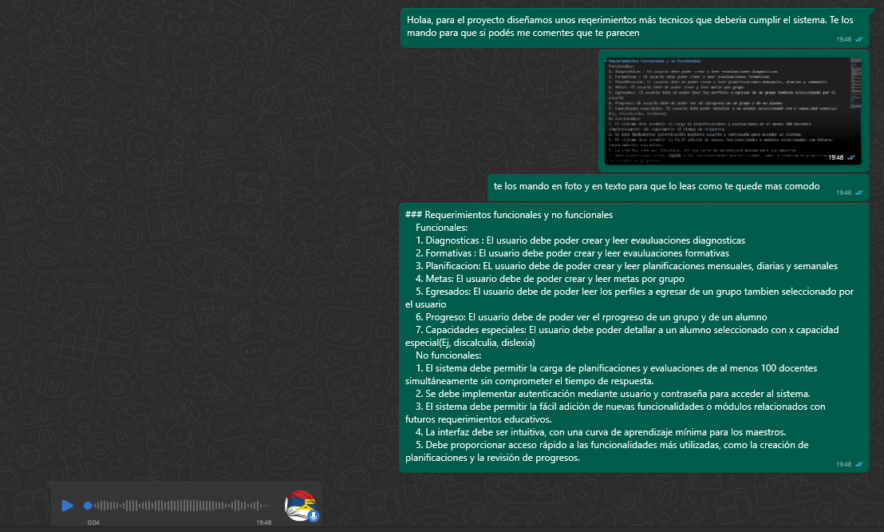

# Informe académico (entrega 1)

## Repositorio Git

### Repositorios locales y remotos

Estaremos trabajando con un repositorio en la nube que los profesores nos proporcionaron mediante un link y lo clonamos localmente para poder trabajar cada uno en su computadora personal con el comando git clone y el url del repositorio remoto.

### Aplicación de comandos Git

Cuando no continuaremos el avance del trabajo, con el comando "git add ." estaremos enviando todos los cambios al área de staging (fase de preparación) en donde luego vamos a poder subirlos al repositorio local usando "git commit -m '' " dejando un mensaje de descripción de los cambios hechos y finalmente subiendo los cambios a la nube usando "git push".
A partir de la rama de cada uno de los integrantes podrían haber ramas para las features que sean temporales usando el comando "git branch 'nombre_de_rama'" y nos iremos moviendo por las ramas usando "git checkout 'nombre_de_rama'". Usaremos el comando "git merge 'nombre_de_rama'" para pasar una versión avanzada del proyecto al main o si a algún participante le falta ciertas partes del proyecto en su rama personal usa el comando mencionado para rellenar lo que le falta de la rama de producción, o viceversa.

## Versionado

### Buenas prácticas de versionado

En cada commit vamos a poner una mínima descripción general de lo que se va a guardar adjuntado a la inicial del nombre la persona que lo hizo (M, G, J). Se hará un merge cada vez que terminemos de trabajar a la rama producción para tener un punto de control a donde subir los avances hechos en las ramas personales y que el resto del equipo pueda acceder a ellas antes de subirlas a la rama main.

### Evolución del proyecto

Realizamos entrevista a una maestra y nos pusimos en contacto con otro maestro de informatica del Crandon
[Google Docs](https://docs.google.com/spreadsheets/d/1ZaYrqsE-KZGrTCM1AXqhUkDM-aP1vH2Bp0uPxzgTKiU/edit?usp=sharing "Google Sheet")
Modificamos correcciones que notaron en el checkpoint, agregamos los bocetos, Use Cases, validación y verificación.

## Elicitación

Realizamos una entrevista con una maestra conocida de los compañeros en la en la que hacemos preguntas introductorias al tema (planificación general, planificación personalizada y variables a tomar en cuenta). Conclusión de esta entrevista realizamos un bocetos del IU y estipulamos unos requerimientos funcionales. Luego usamos IA generativa chatGPT para ayudarnos con los requerimientos no funcionales.

### Evidencia de actividades de investigación

[Link entrevista](https://fi365-my.sharepoint.com/:v:/g/personal/ma291799_fi365_ort_edu_uy/ESiGoK3UF7tAqHUvDucqVSwBCvQJXC1V6NlH2iurapJMig?e=r43Wgy)

### Referencias a fuentes de información

Como fuentes de información tenemos el link de [ANEP](https://www.dgeip.edu.uy/transformacion-educativa/)
ChatGPT para el uno de los bocetos(como es un chat del tipo generador de imagen no me deja mandar el link):

[Chat para requerimientos NF](https://chatgpt.com/share/671b7eae-6668-800b-a43f-9e19b2cf9891)

### Caracterización de usuarios

El usuario objetivo de este programa será cualquier docente de la educación media-basica al cual le sea conveniente el acceso rapido y practico a todas las funcionalidades que ofrece el programa (capacidades especiales, programa curricular, diagnosticas, entre otros). No será necesario que el usuario tenga conocimientos tecnicos avanzados sobre el uso de una computadora debido a la accesibilidad del programa.

### Modelo conceptual del problema

## Especificación

### Requerimientos funcionales y no funcionales

    Funcionales:
    1. Diagnosticas : El usuario debe poder crear y leer evauluaciones diagnosticas
    2. Formativas : El usuario debe poder crear y leer evauluaciones formativas
    3. Planificacion: EL usuario debe de poder crear y leer planificaciones mensuales, diarias y semanales
    4. Metas: El usuario debe de poder crear y leer metas por grupo
    5. Egresados: El usuario debe de poder leer los perfiles a egresar de un grupo tambien seleccionado por el usuario
    6. Progreso: El usuario debe de poder ver el progreso de un grupo y de un alumno
    7. Capacidades especiales: El usuario debe poder detallar a un alumno seleccionado con x capacidad especial(Ej, discalculia, dislexia)
    No funcionales:
    1. El sistema debe permitir la carga de planificaciones y evaluaciones de al menos 100 docentes simultáneamente sin comprometer el tiempo de respuesta.
    2. Se debe implementar autenticación mediante usuario y contraseña para acceder al sistema.
    3. El sistema debe permitir la fácil adición de nuevas funcionalidades o módulos relacionados con futuros requerimientos educativos.
    4. La interfaz debe ser intuitiva, con una curva de aprendizaje mínima para los maestros.
    5. Debe proporcionar acceso rápido a las funcionalidades más utilizadas, como la creación de planificaciones y la revisión de progresos.

### User stories

    <Diagnosticas>
    Como <maestro>
    Quiero poder <leer, modificar y crear pruebas diagnosticas>
    Para <obtener un punto de partida para el grupo en el cual esta trabajando>

    Criterios de aceptación <Cada estudiante puede tener 1 sola prueba diagnostica y la prueba no conlleva nota numerica>

    <Formativas>
    Como <maestro>
    Quiero poder <leer, modificar y crear pruebas formativas>
    Para <Obtener apuntes rapidos sobre como va progresando un estudiante>
    Criterios de aceptación <Cada estudiante puede tener prueba formativas y la prueba no conlleva nota numerica>

    <Planificación de clases>
    Como <maestro>
    Quiero poder <crear planificaciónes con toda la información pertinente como apoyo>
    Para <facilitar, agilizar y mejorar la planificación de clases>
    Criterios de aceptación <Cada planificación tiene que tener visible en pantalla la información pertinente para esto>

    <Visualización de progreso>
    Como <maestro>
    Quiero poder <ver el progreso de los estudiantes>
    Para <poder hacer una planificación mas especifica y teniendo en consideración lo que le hace falta a los estudiantes>
    Criterios de aceptación <El progreso debe de ser mostrado por categorías (lengua, matematica, etc)>

    <Visualización de perfil de egresado>
    Como <maestro>
    Quiero poder <Tener disponible toda la informacion de los programas de la ANEP sobre el perfil de egresados del año del grupo selecccionado>
    Para <Poder hacer una planificación del curso teniendo en consideración a donde hay que llegar y tambien poder ver lo que ya deberían saber los estudiantes>
    Criterios de aceptación <La información tiene que estar toda precargada dependiendo del grupo seleccionado>

### Use cases

Crear planificación
Actor: Maestra
Pre condición: Tiene que ingresar al sistema, abrir su planificación y seleccionar un día.
Secuencia normal: Agregar un elemento en el dia seleccionado detallando la actividad.
Rendimiento: Agrega en el dia seleccionado de la semana y mes el elemento creado.

Modificar planificación
Actor: Maestra
Pre condifición: Tiene que ingresar al sistema, abrir su planificación y seleccionar un elemento
Secuencia normal: Le permite modificar los elementos que seleccionó.
Rendimiento: Guarda los cambios hechos

Crear y ver pruebas
Actor: Maestra
Pre condición: Estar ingresado al sistema.
Secuencia normal: Podrá ver las pruebas ya creadas en caso de que quiera modificar alguna o podrá crear una nueva.
Rendimiento: Muestra las pruebas ya creadas y en caso de que se cree una nueva se guardará

Ver planificación
Actor: Agente externo a la maestra(ej. Directora)
Pre condifción: Estar ingresado al sistema.
Secuencia normal: Podrá abrir la planificacion de una maestra abriendo un archivo y visualizarla pero no modificarla.
Rendimiento: Carga toda la planificacion.

### Bocetos de IU

[Boceto en excel](https://docs.google.com/spreadsheets/d/1ZaYrqsE-KZGrTCM1AXqhUkDM-aP1vH2Bp0uPxzgTKiU/edit?usp=sharing)

## Checkpoint obligatorio 1

Incluir un resumen del avance en elicitación y especificación de requerimientos
Se evaluará de acuerdo al grado de avance

## Validación y verificación

### Verificación/

### Validación

## Reflexión

### Detalle del trabajo individual

Detallar: fecha, actividad, horas, responsable

- 26/9, repositorios locales y remotos/aplicación de comandos de git/buenas practocas de versionado/referencias, Gonzalo
- Actualizacion de branches, requerimientos y boceto UI Martin 29/9
- 29/9 Actualizacion resumen de elicitación 20:06 Juan
- 30/9, Boceto IU(IA), Modelo conceptual del problema, Gonzalo
- 22/10 Actualización aplicación comandos git 08:31 Juan
- 22/10 Inclusión de requerimientos no funcionales 11:38 Juan
- 22/10 Use Cases, Gonzalo
- 22/10 Agrego validacion requerimientos 20:00 Martin
  Incluir totales de esfuerzo

### Técnicas aplicadas y aprendizajes
