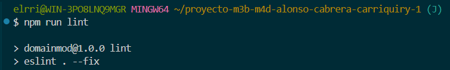
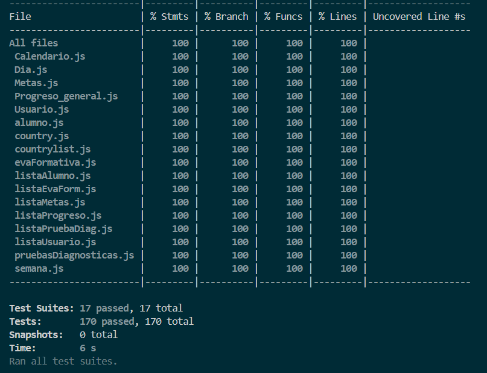

# Informe académico (entrega 2)

## Construcción

### Implementación de funciones principales

Las funciones principales en funcionamiento son:

- Creacion y lectura de pruebas diagnosticas
- Creacion y lectura de Evaluaciones formativas
- Creacion y lectura de metas
- Lectura de toda la informacion pertinente sobre el perfil de los egresados por la ANEP

Las faltantes:

- Creacion y lectura de planificaciones
- Implementacion de capacidades especiales
- Ingreso por usuario y contraseña como metodo de verificación
- Visualizacion del progreso

### Librerías externas
Las librerías externas que se usaron para la implementación del proyecto fueron las siguientes:
- Bootstrap: Esta fue usada para diseñar la página web mediante el archivo html y mejorar su estética, funcionalidad, usabilidad y accesibilidad en cualquier dispositivo.
- Jest: Se utilizó para crear las pruebas unitarias y poder detectar inconsistencias en el código (en este caso las clases del dominio)
- Nodes.js: Esta se uso para poder ejecutar las pruebas unitarias de las clases del dominio con Jest. 
- ESLint: Esta se usó para definir estandares para la codificación del proyecto, evaluar el código antes de ser ejecutado y verificar que se cumplen las reglas configuradas dentro del archivo "eslint.config.mjs"
- Prettier: Esta se usó para automatizar y estandarizar el formateo del código, mejorando la legibilidad y la consistencia del mismo.

## Interfaz de usuario

### Buenas prácticas
Las buenas prácticas utilzadas para implementar el interfaz de usuario fueron las siguientes:
- el uso de de Bootstrap en donde facilita el diseño responsivo, la creación de componentes y la personalización de la interfaz de usuario desde el archivo html.
- La implementación de una barra de navegación en donde el usuario puede dirigirse a diferentes secciones de la página dandole click en la sección correspondiente.
- La navegación es intuitiva, es decir que los usuarios pueden encontrar lo que buscan facilmente.
  
### Usabilidad
La página permite a los usuarios registrar alumnos, pruebas diagnósticas, Evas formativas y metas permitiendo también la visualización de perfiles de egresados, pruebas diagnósticasu Evas formativas ya registradas. La funcionalidad de la página permite que los usuarios puedan hacer todo lo mencionado de forma sencilla y rápida, facilitando la experiencia del usuario.
### Accesibilidad
La página es accesible para cualquier usuario que quiera entrar desde cualquier dispositivo ya que se utilizó Bootstrap para diseñar la página web y mejorar su estética, también permite la navegación intuitiva para moverse entre las secciones sin dificultad y devuelve una retroalimentación visual la cual permite al usuario ver que acción se realizó en la página (Por ejemplo si el registro de un alumno fue exitoso o no). 
## Codificación

### Configuración de entorno de desarrollo
Para el proyecto usamos los siguientes entornos:
- Visual studio code: Se utilizó como editor de código para escribir el código, realizar las pruebas unitarias y documentar el proyecto a través de archivos markdown.
- Git: Se utilizó para realizar el control de versiones del proyecto, permitiendo la colaboración entre los miembros de equipo.
- GitHub: Se utilizó para alojar el repositorio del proyecto en una nube, permitiendo el acceso y la colaboración sobre el proyecto entre los miembros del equipo sobre.
- Librerías externas: Se utilizaron las librerías externas mencionadas en la documentación como buenas prácticas para implementar el interfaz de usuario y realizar las pruebas unitarias.
- Configuracion de proyecto: Se tiene el archivo "package.json" para administrar dependencias, scripts y archivos de configuración de ESLint para definir estándares de codificación del proyecto.
- Navegador web: Se utilizó Google Chrome para probar la funcionalidad, verificar y depurar la página web.
- Servidor local: Se utilizó la extensión de Visual Studio Code llamado "Live Server" para probar la funcionalidad de la página web en un servidor local.
### Estándares de codificación
- Reglas de ESLint usadas:
    - Se usaron las reglas definidas dentro de la configuración pre-definida de ESLint "pluginJs.configs.recommended" (es la configuración de reglas recomendadas por ESLint para JavaScript).
    - "no-alert": "warn" (Advertir que se están usando las funciones "alert", "confirm" o "prompt" en el código).
    - "no-var": "warn" (Advertir que hay variables inicializadas con "var" en el código).
    - "max-depth": ["warn", { max: 3 }] (Advertir que se superó la profundidad máxima a de bloques permitdos, en este caso son 3).
    - "max-statements": ["warn",{ max: 15 },{ ignoreTopLevelFunctions: true },] (Advertir que se superó la máxima cantidad de declaraciones permitidas, en este caso son 15).

Las reglas recomendadas están marcadas con un tick en la [página de reglas ESLint](https://eslint.org/docs/latest/rules).

### Buenas prácticas de OOP
- Pruebas unitarias: Para cada clase del dominio se crearon pruebas unitarias Jest que recorren todas las funciones dentro de las clases y evaluan todas las salidas posibles dependiendo de la entrada dada.
### Análisis estático de código
En este proyecto se usó el linter para JavaScript, ESLint. Este nos ayudó a que el código siga ciertas reglas y estándares de codificación antes de ejecutarlo.
#### Al ingresar el comando "npm run lint" en la consola, nos aparace lo siguiente

Esto significa que el código cumple con todas las reglas de ESLint definidas en el archivo eslint.config.mjs y el código que se podía arreglar con "--fix" se arregló automáticamente.
## Checkpoint obligatorio 2

Incluir un resumen del avance en **codificación de la IU y clases del dominio**
Se evaluará de acuerdo al grado de avance

Para el dominio fuimos creando varias clases basandonos en el UML que usamos para el primer informe, dentro de cada clase codificamos los constructores, funciones get, en algunas hicimos funciones "toString" y otras funciones que ayudan en el guardado de datos dentro del objeto que representa cada clase.

Creamos un nav para las secciones {Pruebas Diagnosticas, Evas Formativas, Metas, Progreso General, Perfiles Egresados, Calendario} en las cuales iremos agregando las funcionalidades.
Hicimos un merge de produccion a main para el checkpoint como avance.

## Test unitario

### Buenas prácticas
- Se escribió al menos una prueba Jest para cada función para poder detectar errores en una etapa temprana del proyecto.
- Cada prueba Jest tiene un nombre que describe lo que hace.
- Ninguna prueba depende de otra, es decir que el resultado de una prueba Jest no va a afectar el resultado de otra.
- Cada vez que se avanzaba con el dominio u ocurría algún cambio para alguna función de una clase del dominio, se actualizaban las pruebas Jest y en algunos casos se cambiaban las salidas esperadas.
- Se crearon pruebas para casos exitosos donde la salida debe ser la esperada y otras para casos en donde la salida es un error (caso fallido).
- Cada vez que se suponía que se terminaba de codificar los test unitarios de una de las clases del dominio, siempre se verificaba la cobertura usando Node.js ingresando el comando "npm run test" en la consola.
### Informe de cobertura
#### Al ingresar el comando "npm run test" en la consola nos aparece lo siguiente

Esto significa que se corrieron todos los casos de prueba unitaria Jest de manera correcta y que se cubrió un 100% de salidas de funciones en todas clases del dominio.
## Reflexión

### Detalle del trabajo individual

Detallar: fecha, actividad, horas, responsable
Incluir totales de esfuerzo
2/11/2024, Creación y avanzado del dominio, 1 hora, Juan
3/11/2024, Creación de las clases lista del dominio, 20 minutos, Juan
12/11/2024, Creación de los archivos Jest, 2 horas, Juan
24/11/2024, Implementacion de pruebas diagnosticas, perfiles egresados, Evaluaciones formativas, ingreso de metas. Todas estas en html y js., Martin
29/11/2024, Inicio de documentación buneas prácticas OOP, librerías externasy estandares de codificación, 2 horas, Juan 
30/11/2024, Avnaces en la documentación test unitario, análisis estático de código y buenas prácticas de IU, 2 horas, Juan
2/12/2024, Avances en la documentacion de funciones implementadas, Martin
2/12/2024, Carga de sesion de testing realizada por, Martin
2/12/2024, Finalización del informe 2, 2 horas, Juan

### Técnicas aplicadas y aprendizajes
