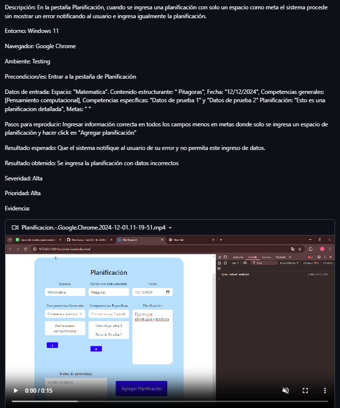

# Informe de testing

Proyecto asignado: [link](https://github.com/IngSoft-FIS-2024-2/proyecto-m3b-m4d-alvarez-tonto)

## Test de sistema

### Diseño de casos de prueba
Para el diseño de los casos de prueba, primero usamos los formularios para basarnos en que datos podrían ser válidas, cuales pueden ser erroneas y de ahí crear las clases de equivalencia.
Creamos los casos de prueba verificando de que se cubran todas las clases de equivalencia para cada función de la página.
Por si acaso se detalla que los casos de prueba estan en la segunda página.
Link a las clases de equivalencia y a los casos de prueba [acá](https://docs.google.com/spreadsheets/d/1aR5kO1y0SNiRM_9YoAVtgcerwV8a3r_3nGwb_l5TN9A/edit?gid=0#gid=0)
### Definición de ambientes de testing y ejecución de casos
Todas las pruebas son ejecutadas en windows 11 y en google chrome a la version más reciente hasta la fecha pero cada una de las sesiones de testing son ejecutadas en diferentes entornos de testing. En nuestro caso son ejecutadas en distintas computadoras y los errores que econtramos son validados por otro de nuestros compañeros en otra computadora antes de siquiera publicar un issue. Esto se hace para garantizar la veracidad y calidad de tanto los issues como de las sesiones de testing.
### Sesiones de pruebas exploratorias
Se realizan tres sesiones de testing exploratorio, una por cada integrante. Encontrando algunos bugs los cuales son reportados cumpliendo los estandares aqui dispuestos. Se dejan los informes de las sesiones de pruebas exploratorias dentro de la carpeta docs como distintos pdf.
## Reporte de issues
### Buenas prácticas de reporte
Cada issue tiene un título que describe bien el defecto encontrado dentro de la sesión de prueba y está organizado de tal manera de que el lector pueda seguir detalladamente como se halló el defecto reportado y de que se trata. También dentro del reporte se incluye detalles como entorno y navegador en la cual se realizó la prueba, la severidad y prioridad del issue y una grabación o captura de pantalla mostrando el defecto dentro de la página.
En resumen se cumple con el siguiente template:
- Descripcion:
- Entorno:
- Sitio Web:
- Ambiente:
- Precondición/es:
- Datos de entrada:
- Pasos para reproducir:
- Resultado esperado:
- Severidad:
- Prioridad:
- Evidencia:

Quedará de la siguiente manera:

### Clasificación
Los issues se clasificaron por su prioridad y severidad dependiendo de que tanto afecta el defecto al sistema y si es necesario que se corrija de inmediato.
## Informe de calidad del sistema

### Resumen de issues por tipo y severidad

|  ISSUE |SEVERIDAD      | PRIORIDAD |
|--------|---------------|-----------|
| **1**  |   Baja        |   Media   |
| **2**  |   Alta        |   Alta    |
| **3**  |   Alta        |   Alta    |
| **4**  |   Alta        |   Alta    |
| **5**  |   Alta        |   Alta    |
| **6**  |   Alta        |   Alta    |
| **7**  |   Alta        |   Alta    |
| **8**  |   Alta        |   Alta    |

### Evaluación global de calidad
El sistema siempre y cuando el usuario ingrese los datos correctos, funciona correctamente y podría ser usado para cumplir con la tarea por la cual fue creada. Sin embargo, si el usuario ingresa datos erroneos hay una alta probabilidad (debido a la cantidad de bugs encontrados en la fase de testing) de que el sistema no funcione correctamente y no cumpla con la tarea para la cual fue creada.
En conclusión es una buena primera versión, pero no es apta para llegar al usuario final.  
## Reflexión

### Detalle del trabajo individual

Detallar: fecha, actividad, horas, responsable
Incluir totales de esfuerzo
2/12/2024, Carga de sesion de testing realizada por, Martin
2/12/2024, Avance en documentacion de sesiones de testing , def de ambientes de testing  y resumen de issues
2/12/2024, Finalización de informe testing, 5 horas, Juan

### Técnicas aplicadas y aprendizajes
